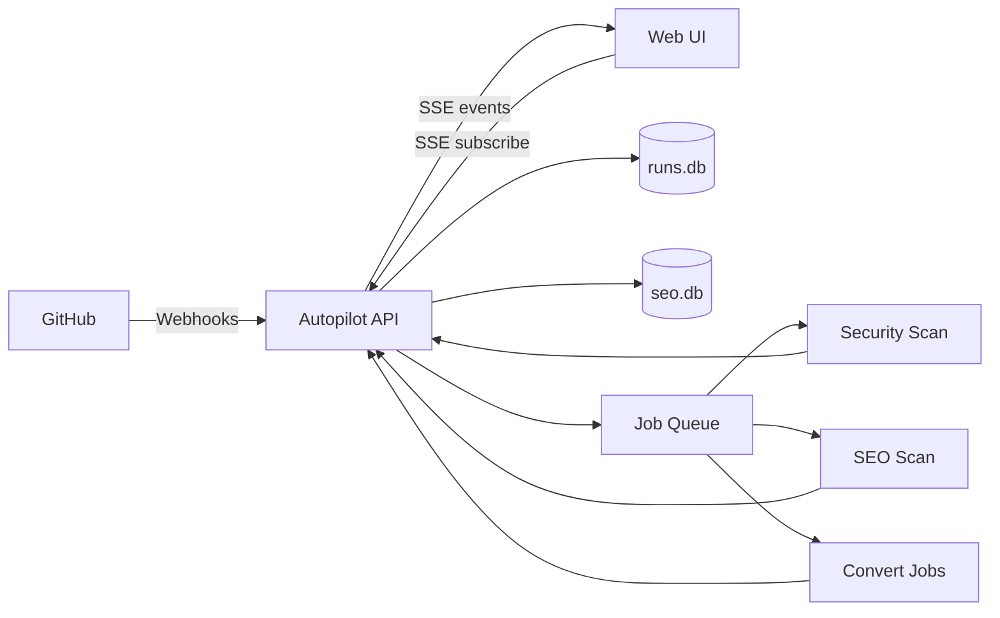
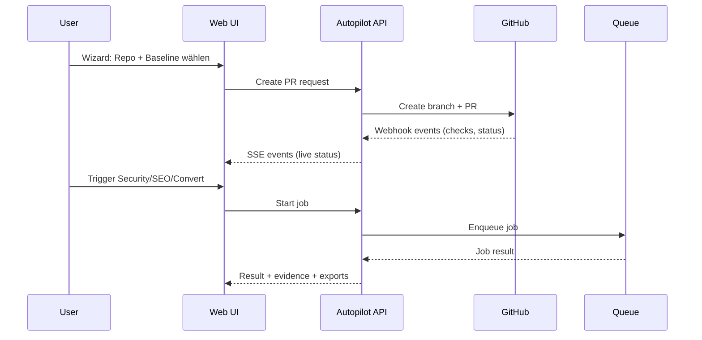

<!--
IMBA Org Profile README
Pfad: .github/profile/README.md
Optional Assets: .github/profile/assets/
-->

  

<h1 align="center">IMBA Baseline Autopilot</h1>

  GitHub App installieren • Baseline-PR erstellen • Status live verfolgen • Security/SEO Checks • Conversion Utilities

  
  
  
  

---

## TL;DR
IMBA automatisiert das Einspielen einer **secure CI baseline** per Pull-Request und ergänzt den Workflow um **Live-Monitoring**, **Security- und SEO-Checks** sowie **Convert-Utilities**.  
Alles ist auf **Transparenz** (Evidence/Exports) und **Safety Rails** (Policies/Overwrite-Guards) ausgelegt.

---

## Produkt-Flows (High-Level)

---

## Features

<table>
  <tr>
    <td width="50%">
      <h3>Wizard</h3>
      
<b>Repo wählen → Baseline auswählen → PR erstellen</b>

      <ul>
        <li>Baselines: <code>secure-ci</code>, <code>secure-ci+obs</code>, Recipes speichern/laden</li>
        <li>Org-Policies enforced (z. B. Trivy blocking Pflicht, Overwrite verboten)</li>
        <li>Diff-Preview: Required/Optional/Konflikt-Badges</li>
        <li>Overwrite-Safety-Rail: Modal + Type-to-confirm</li>
      </ul>
      
<i>Screenshot:</i> <code>assets/screen-wizard.png</code>

    </td>
    <td width="50%">
      <h3>Monitor / Runs</h3>
      
<b>Live-Status, Failure-Classifier, Artefakte</b>

      <ul>
        <li>SSE Live-Updates, Filter, Auto-Refresh</li>
        <li>Failure-Tags/Classifier (z. B. auth/repo/ci/security)</li>
        <li>Artefakt-Snippets + Download-Links (TTL)</li>
      </ul>
      
<i>Screenshot:</i> <code>assets/screen-monitor.png</code>

    </td>
  </tr>

  <tr>
    <td width="50%">
      <h3>Security Check</h3>
      
<b>Threat / Suspicious / Hardening</b> mit Evidence

      <ul>
        <li>Threat-Intel optional (Safe Browsing, weitere Feeds)</li>
        <li>Headers/TLS/Redirect/Mixed Content/Cookies/Downloads/Runtime</li>
        <li>Evidence-Panel: Punkte + Confidence, Filter/Sort</li>
        <li>Export JSON/CSV, Share-Link (TTL), Allowlist (Hardening-mute)</li>
      </ul>
      
<i>Screenshot:</i> <code>assets/screen-security.png</code>

    </td>
    <td width="50%">
      <h3>SEO Check & Monitoring</h3>
      
Technischer On-Page-Audit + Historie + Alerts

      <ul>
        <li>Meta/Canonical/Robots/X-Robots, OG/Twitter, hreflang</li>
        <li>robots.txt + Sitemap Fetch/Parsing, deterministisches Sampling</li>
        <li>Broken Links/Images (Sample), JSON-LD sanity checks</li>
        <li>Monitoring: Schedules + History + Regression Alerts</li>
        <li>Performance: <b>Lab</b> (TTFB/FCP/LCP/CLS/INP) als Warnungen</li>
      </ul>
      
<i>Screenshot:</i> <code>assets/screen-seo.png</code>

    </td>
  </tr>

  <tr>
    <td width="50%">
      <h3>Convert</h3>
      
Batch-Conversion (Markdown ↔ PDF/DOCX) mit Presets

      <ul>
        <li>Presets: IMBA / Minimal / Dark</li>
        <li>OCR optional</li>
        <li>Limits: max 10 Dateien, 8 MB • Downloads via TTL</li>
        <li>Retry/Delete + History</li>
      </ul>
      
<i>Screenshot:</i> <code>assets/screen-convert.png</code>

    </td>
    <td width="50%">
      <h3>Ops</h3>
      
Status & Logs für Webhook/App/Token

      <ul>
        <li>Letzte Events, Test-Ping, Auto-Refresh</li>
        <li>Webhook-URL nur per Copy nach Installationswahl</li>
        <li>Status-Pills (API/Webhook/Queue)</li>
      </ul>
      
<i>Screenshot:</i> <code>assets/screen-ops.png</code>

    </td>
  </tr>
</table>

---

## Architecture (kompakter Blick)

---

## Quickstart (für Nutzer)
1. GitHub App installieren (Org/Repo auswählen)
2. Wizard öffnen → Baseline auswählen → PR erstellen
3. Monitor öffnen → Live-Status, Artefakte, Findings

---

## Trust & Grenzen
- Security/SEO sind **Web-Scans** (HTTP/HTML/Heuristiken + optional Threat-Intel), **kein** Endpoint-/AV-Scan.
- Share-Links und Downloads sind **TTL-basiert** (laufen automatisch ab).
- Convert hat **harte Upload-Limits** und löscht Ergebnisse nach Ablauf.

---

## Repositories (empfohlen pinnen)
- `imba-starter-kit`
- `imba-baseline-autopilot` (oder Hauptrepo)
- `docs` / `runbooks` / `examples` (je nach Struktur)

---

## Assets (optional)
Lege Bilder hier ab:
- `.github/profile/assets/imba-banner.png`
- `.github/profile/assets/screen-wizard.png`
- `.github/profile/assets/screen-monitor.png`
- `.github/profile/assets/screen-security.png`
- `.github/profile/assets/screen-seo.png`
- `.github/profile/assets/screen-convert.png`
- `.github/profile/assets/screen-ops.png`

Wenn du (noch) keine Bilder hast: Entferne einfach den Banner-Block oben und die Screenshot-Zeilen.

---

## Kontakt / Contribution
- Issues: Bitte über GitHub Issues im passenden Repo
- Diskussionen/Feedback: GitHub Discussions (falls aktiviert)
