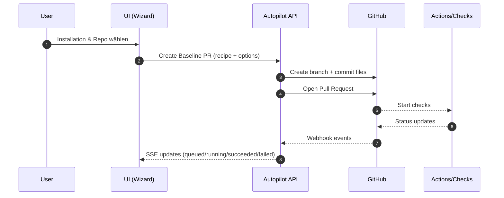

<!--
IMBA Org Profile README
Location: imbalabs/.github/profile/README.md
Tip: Put images under imbalabs/.github/profile/assets/ and reference them relatively.
-->

<div align="center">

<!-- Replace with your actual logo/banner paths once you add them -->


# IMBA Baseline Autopilot

**GitHub App installieren → Baseline-PR erzeugen → Runs live verfolgen → Security/SEO prüfen → Artefakte & Exporte ziehen.**

<a href="#quickstart">Quickstart</a> •
<a href="#features">Features</a> •
<a href="#architecture">Architecture</a> •
<a href="#repos">Repos</a> •
<a href="#docs--trust">Docs</a>

<!-- Optional badges (adjust repo names / URLs) -->


</div>

---

## TL;DR
IMBA ist ein DevOps‑Autopilot: Er spielt **vorkonfigurierte Baselines** (z. B. `secure-ci`, `secure-ci+obs`) per Pull Request in Repos ein, setzt **Org‑Policies** durch, zeigt **Run‑Status live** an und bietet zusätzlich **Security‑ und SEO‑Analysen** sowie **Conversion‑Utilities**.

---

## Quickstart

### 1) GitHub App installieren
- GitHub App in der Organisation installieren
- Zugriff auf das Ziel‑Repo erlauben

### 2) Wizard öffnen
- Installation auswählen → Repo auswählen
- Baseline wählen (`secure-ci` / `secure-ci+obs`)
- Optionen prüfen (Policies werden serverseitig enforced)

### 3) PR erstellen & Live‑Status verfolgen
- PR wird erstellt
- Run erscheint automatisch im Monitor
- Status wird per **SSE** live aktualisiert

> Tipp: Lege in deinem Hauptrepo ein `README.md` an, das auf die Docs und den Wizard verlinkt.

---

## Features

<table>
<tr>
<td width="33%" valign="top">

### Wizard
**Baseline‑Composer & Policies**
- Installations‑ & Repo‑Auswahl
- Recipes speichern/laden
- Org‑Policies (z. B. Trivy blocking Pflicht, Overwrite verboten)
- Diff‑Preview (Required/Optional/Konflikte)
- Overwrite Safety‑Rail (Modal + Type‑to‑confirm)

</td>
<td width="33%" valign="top">

### Monitor / Runs
**Live‑Status & Artefakte**
- SSE‑Live‑Updates
- Filter & Auto‑Refresh
- Failure‑Classifier / Tags
- Artefakt‑Snippets & Download‑Links

</td>
<td width="33%" valign="top">

### Ops
**Status & Webhooks**
- Webhook/App/Token Checks
- Letzte Events + Test‑Ping
- Auto‑Refresh (wie Runs)

</td>
</tr>
<tr>
<td width="33%" valign="top">

### Security
**Web‑Scanner (kein AV/Endpoint)**
- Verdicts: Threat / Suspicious / Hardening
- Evidence‑Panel (Weights/Confidence)
- Export JSON/CSV
- Share‑Links mit TTL
- Allowlist (nur Hardening‑Mute)

</td>
<td width="33%" valign="top">

### SEO
**Analyzer + Monitoring**
- Meta/Canonical/Robots/X‑Robots
- hreflang, Sitemap/robots, Link/Image sampling
- Structured Data sanity checks
- Lab‑Performance (klar als „Lab“ gekennzeichnet)
- History + Regression‑Alerts + Schedules

</td>
<td width="33%" valign="top">

### Convert
**Batch‑Conversion**
- Markdown ↔ PDF/DOCX
- Presets (IMBA/Minimal/Dark)
- OCR optional
- Limits + TTL, Retry/Delete

</td>
</tr>
</table>

---

## Architecture

### High‑Level
```mermaid
flowchart LR
  U[User] --> UI[Web UI]
  UI -->|REST| API[Autopilot API (Node)]
  UI -->|SSE| SSE[SSE Stream]

  API --> GH[GitHub App API]
  GH --> Repo[Target Repos]

  API --> DB1[(Runs DB)]
  API --> DB2[(SEO DB)]

  API --> SEC[Security Scanner]
  API --> SEO[SEO Analyzer]
  API --> CONV[Convert Service]

  subgraph Storage
    DB1
    DB2
  end

  Repo --> CI[GitHub Actions]
  CI --> API
  API --> SSE
```

### Baseline‑Flow (Wizard → PR → Run)


---

## Screenshots (optional)
> Lege die Bilder unter `.github/profile/assets/` ab und passe die Pfade an.

| Wizard | Monitor | Security | SEO |
|---|---|---|---|
|  |  |  |  |

---

## Repos
Pinne auf der Org‑Overview idealerweise 4–6 Repos.

**Empfohlen:**
- `imba-starter-kit` — Starter‑Repo + Templates
- `imba-baseline-autopilot` — Autopilot‑Backend/UI (falls separiert)
- `docs` — Dokumentation (oder Wiki/Pages)
- `examples` — Beispiel‑Repos / Demos

> Wenn du alles in einem Repo hast: pinne das Hauptrepo und ergänze „docs/“ + Releases.

---

## Docs & Trust
- **Docs:** Quickstart, FAQ, Troubleshooting, Status, Changelog
- **Security/SEO:** Web‑Checks (HTTP/HTML/Heuristiken + optional Threat‑Intel), **kein** Endpoint-/AV‑Scan.
- **TTL:** Share‑Links & Downloads laufen ab; Convert‑Uploads werden nicht dauerhaft gespeichert.

---

## Contributing
- Issues/PRs willkommen.
- Bitte bei größeren Änderungen zuerst ein Issue eröffnen (Problem → Ziel → Ansatz).

---

<div align="center">

**© IMBA Labs · Baseline Autopilot**

</div>
